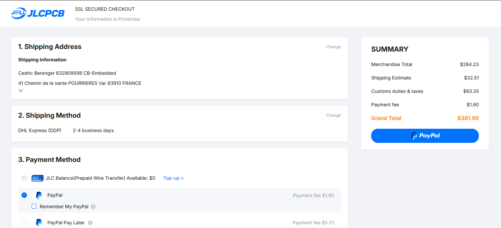

# Commande JLCPCB — Badge HIP SecSea V1.2

Estimatif JLCPCB — 5 exemplaires, assemblage double face. À valider (quantité, coût).

## Page 1 — Paramètres PCB & Assemblage

- **PCB** : 4 couches, 1.6 mm, HASL Lead Free, couleur noire, 5 pcs
- **Surface finish** : LeadFree HASL
- **Assembly** : Both Sides (Top + Bottom), 5 pcs
- **Advanced options** : Bake Components activé (requis pour les WS2812B, sensibles à l'humidité)

## Page 2 — BOM & Placement

### BOM exhaustive

Prix en dollars. Fichier complet :
[bom-JLCPCB Assembly Order.xls](bom-JLCPCB%20Assembly%20Order.xls)

#### Top 10 des composants par coût (par PCB, sur 5 pièces)

| #   | Désignateur | Composant                                     | $/PCB |
| --- | ----------- | --------------------------------------------- | ----: |
| 1   | U3          | W25Q128JVSIQ — Flash QSPI 128Mbit             | $2.52 |
| 2   | ANT0        | ACAG1204-433-T — Antenne céramique 433MHz     | $1.99 |
| 3   | U4          | CC1101RGPR — RF transceiver sub-GHz           | $1.54 |
| 4   | U1          | RP2040 — MCU                                  | $0.98 |
| 5   | U6          | TPS63000DRCR — Buck-boost DC-DC               | $0.91 |
| 6   | C29–C36     | 1µF 0805 × 8                                  | $0.86 |
| 7   | C39–C41     | 47µF 0805 × 3                                 | $0.84 |
| 8   | U2          | 74HC139D — Démultiplexeur 2:4                 | $0.53 |
| 9   | C37–C38     | 10µF 0805 × 2                                 | $0.51 |
| 10  | SAO0, SAO1  | HC-PM254-8.5H-2×3PS — Connecteurs femelle SAO | $0.33 |

Total composants (5 pièces) : **$74.41** → **$14.88/PCB**

### Preview placement — Face avant (Top)

Vue générale de la face avant : RP2040, LEDs WS2812B, boutons SW4/SW5, LEDs de statut D6/D7.

### Preview placement — Face arrière (Bottom) — vue générale

Vue générale de la face arrière : RP2040 (U1), CC1101 RF 433MHz (U4), antenne céramique ANT0, flash QSPI W25Q128 (U3), demux 74HC139 (U2), buck-boost TPS63000 (U6), chargeur TP4056 (U5), connecteurs USB-C / MicroSD / SAO, passifs.

### Preview placement — Face arrière zoomée — bas de carte

Zoom sur la zone basse de la carte.

### Preview placement — Face arrière zoomée — haut de carte

Zoom sur la zone haute de la carte.

## Récapitulatif des prix (hors shipping)

- **PCB Price** : $44.90
  - Engineering fee : $25.00
  - Via Covering : $0.00
  - Surface Finish : $5.20
  - Color : $8.00
  - Board : $6.70
- **Standard PCBA Price** : $239.33
  - Setup Fee : $51.12
  - Stencil : $16.42
  - Panel : $0.00
  - Large Size : $0.00
  - Components (60 items) : $74.41
  - Feeders Loading fee : $91.80
  - SMT Assembly : $5.08
  - Packaging fee : $0.50
- **Advanced Options — Bake Components** : $7.88
- **Sous-total** : $284.23

## Total final avec shipping et douanes

| Poste                                                  | Montant     |
| ------------------------------------------------------ | ----------- |
| Merchandise Total                                      | $284.23     |
| Shipping Estimate (DHL Express DDP, 2-4 business days) | $32.51      |
| Customs duties & taxes                                 | $63.35      |
| Payment fee (PayPal)                                   | $1.90       |
| **Grand Total**                                        | **$381.99** |

