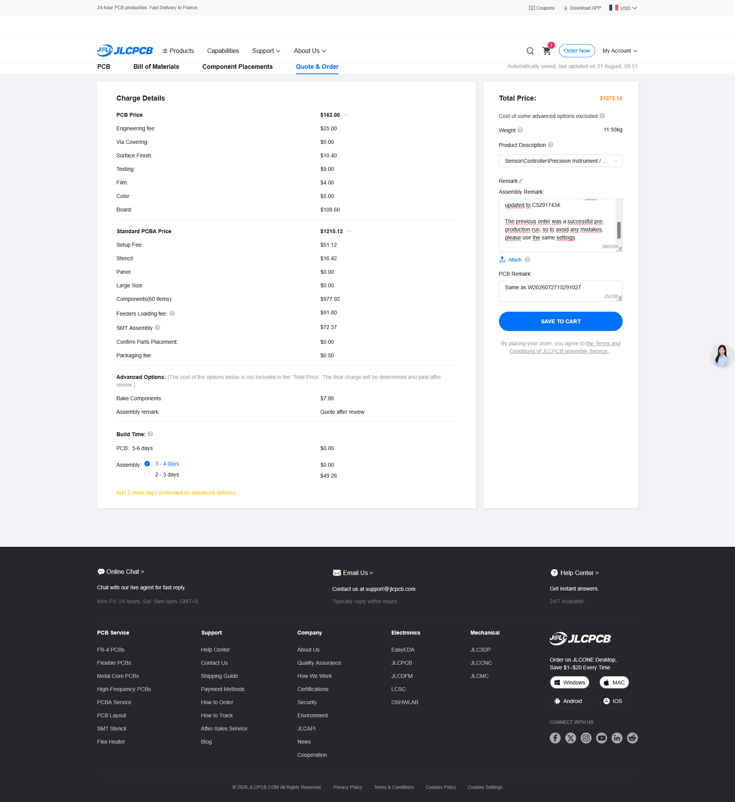

# Production JLCPCB 100pcs

## Coût

Coût d'environs **14€ par Badge pour 100pcs** *(contre 65€ lors de la phase de prototypage)*

## Remarques

- **Mise à jour mineure de la BOM:**
  - La référence des LEDs WS2812B à été mise à jour. En effet, la précédente révision WS2812B-2020 (C965555) est en rupture de stock. Elle a été remplacée dans la BOM par la V6: WS2812B-2020-V6 (C52917434)

- **Demande explicite à JLCPCB de rejouer les mêmes paramètres que la pré-production**:
  - Comme il a fallu mettre à jour la BOM, cela a recréé une commande (pas le même circuit qu'un vrai reorder),
  - Par contre, il s'agit du même gerber et de la même base de BOM que précédemment (pas de réupload des fichiers, ni du pick'n place).
  - Le transistor Q2 n'avait pas la bonne orientation dans la preview, j'ai corrigé manuellement via la GUI de placement JLCPCB.