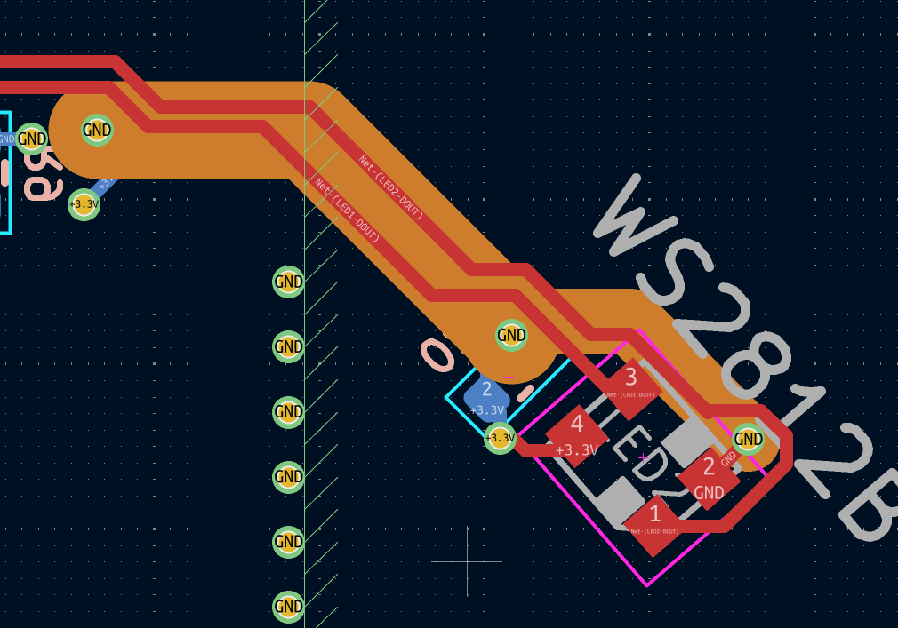

# HIP_SecSea
Hack In Provence badge for SecSea

## Changes from V1.1 (@chris_cannes)

This version is based on the V1.1 design by @chris_cannes. The following changes were made:

**Antenna area**
- Antenna placement and copper zones reworked to comply with CC1101 datasheet requirements.
- Replaced four independent copper cutout polygons with a proper keepout zone (larger, as required by the doc).

**Layer stackup**
- Added a dedicated Ground plane (inner layer).
- Added a dedicated 3.3V Power plane (inner layer).
- Main routing moved to Top and Bottom layers.

**Power distribution**
- The 3.3V distribution tree replaced by a solid 3.3V power plane.

**GND stitching**
- Stitching vias replaced by GND vias placed as close as possible to GND pads, connecting directly into the ground plane. This ensures a controlled, low-impedance GND return path.

## TODO (before production)

- [ ] Rebuild copper planes and stitching vias: add back a proper grid of stitching vias (perimeter, around RF keepout zone, under CC1101) in addition to the pad-level GND vias.
- [ ] **Replace C21 and C26 — 220pF X7R on RF path**: TI reference design specifies NP0/C0G for these positions. Replace with Murata [`GRM1555C1H221JA01D`](https://www.lcsc.com/product-detail/C71693.html) (C0G, 220pF, 50V, 0402, LCSC C71693). Current part [`0402B221K500NT`](https://www.lcsc.com/product-detail/C1530.html) (FH, LCSC C1530, X7R) deviates from reference design; do not second-guess NP0 in an RF path.
- [ ] **Verify crystal load capacitors C17, C18 (27pF)**: X2 specifies 15pF load. CC1101 datasheet gives Cparasitic ≈ 2.5pF typical. Effective load = 27/2 + 2.5 = 16pF — 1pF above target, acceptable. Current 27pF value is correct; no change needed unless crystal frequency trim is required.

- Use tented vias;

- TODO: Changer pour antenne 868MHz (Meilleure efficacité vs petite taille de PCB), (si simple à changer).

- Signaux leds dans bottom: 

- Prod entre 5 et 10.